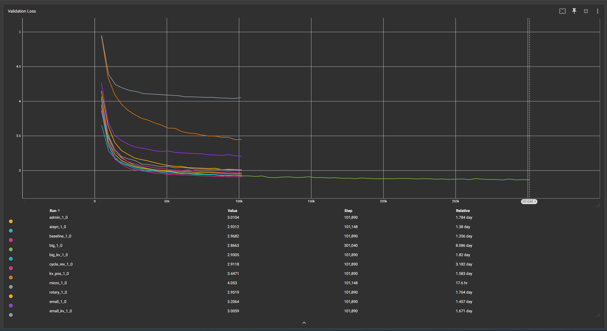

This project is originally based on [a-PyTorch-Tutorial-to-Transformers](https://github.com/sgrvinod/a-PyTorch-Tutorial-to-Transformers).
I have made heavy modifications involving hyperparameter configuration and implementing various methods to improve the performance of the model from other papers.
Papers involved include:
* [Attention Is All You Need](https://arxiv.org/abs/1706.03762)
* [Lessons on Parameter Sharing across Layers in Transformers](https://arxiv.org/abs/2104.06022)
* [RoFormer: Enhanced Transformer with Rotary Position Embedding](https://arxiv.org/abs/2104.09864)
* [ReZero is All You Need: Fast Convergence at Large Depth](https://arxiv.org/abs/2003.04887)
* [On Layer Normalization in the Transformer Architecture](https://arxiv.org/abs/2002.04745)
* [Understanding the Difficulty of Training Transformers](https://arxiv.org/abs/2004.08249)

Results are documented in a spreadsheet [here](https://docs.google.com/spreadsheets/d/1WziFCNZVuQsMLb3RkwV1WOVajbR0igsOZVzZGb_QwTk/edit?usp=sharing).

Example tensorboard graph of validation loss between the different runs:

